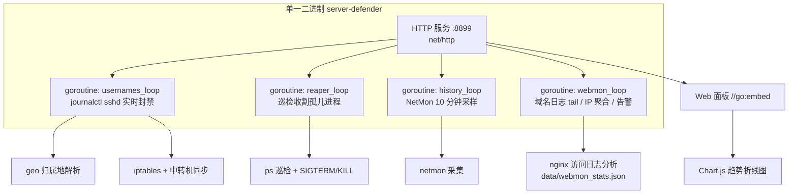

# 🛡️ Server Defender

服务器安全监控与自动防御中心。实时监控 SSH 暴力破解、frps 代理扫描、SYN Flood 攻击，自动封禁恶意 IP，内置主机进程健康自愈（Process Reaper）与网络监控（NetMon），自动收割跑飞失控的死循环孤儿进程。

## 🚀 v2.0.0 Go 重写

**架构变更**：从 Python/Flask 双进程（app.py + usernames.py）重写为 **单一 Go 静态二进制**。合并 `usernames.py` 常驻进程与 `app.py` Web 服务为单进程内的多个 goroutine，彻底移除 venv/Python 依赖。

- ✅ **单文件部署**：`server-defender`（~7.2MB 静态二进制，`CGO_ENABLED=0` 交叉编译，无运行时依赖）
- ✅ **零第三方 Go 依赖**：全部使用 Go 标准库（net/http、html/template、os/exec、encoding/json）
- ✅ **前端内嵌**：HTML/CSS/JS/Chart.js 通过 `//go:embed` 打包进二进制，无外部静态目录
- ✅ **数据兼容**：`data/*.json` 数据结构与 Python 版一致，迁移不丢历史封禁/事件

## 🚀 v3.0.1 优化（2026-09-03）——攻击日历改近一年

- 📅 攻击日历由「近 90 天」改为**近一年（365 天）**经典贡献图，格子 12px→14px，铺满卡片消除右侧大量空置。
- 月标签偏移、周几列同步适配 14px 格子。

## 🚀 v3.0.0 结构标准化（2026-09-03）

**数据目录契约变更（需按本文迁移数据后再部署）**：

- 🔧 `dataDir()` 改为：优先 `DEFENDER_DATA_DIR` 环境变量，否则取**运行工作目录 `/data`**（即胶囊顶层 `data/`），**不再跟随二进制所在目录**——消除 `bin/data` vs `data/` 二义性，与 postsup 胶囊规范一致。
- 🧹 **清理**：删除死代码 `internal/store/`（原子写已由 `service/util.go` 内联）；根目录旧二进制/旧备份/`app.toml.bak` 迁入 `backup/legacy/`。
- 📁 **补齐标准目录**：`config/ logs/ skill/ doc/ test/`。

> ⚠️ **迁移必读**：旧版本数据在 `bin/data`（或根目录 `data/`）。部署前把权威数据放到**顶层 `data/`**（本地历史在顶层 `data/`；阿里云需把 `bin/data` 移到顶层 `data/`），否则新版本会读到空库。

## 🚀 v2.4.1 优化（2026-09-03）——面板归位：SSH 防御进防御页 / 端口有效性进总览

- 🛡️ 把「🔐 frp SSH 隧道自动识别 + 自动封禁」卡并入**防御页**（放在 frps fail2ban 动态封禁之上，均属 SSH 防御）。
- 🔌 总览页新增「frp 隧道端口有效性」卡（逐端口 ssh/tcp/down/skip 态势），与攻击日历同区。

## 🚀 v2.4.0 新增（2026-09-03）——frp SSH 隧道自动识别（阿里云中转机）

新增 `FrpsSSHLoop` 后台协程 + 面板卡片「🔐 frp SSH 隧道自动识别」：

- 🔍 **每日一次 banner 探测**：枚举 `frps` 进程监听的 TCP 端口，逐端口 `TCP 连接 + 读首包`，命中 `SSH-2.0-` 即判定为 SSH 隧道。
- 🧪 **顺带端口有效性判定**：每端口标注 `ssh / tcp / down / skip`（连不上=失效），可在面板展开明细查看。
- ⚙️ **自动并入 SSH 防御**：把识别出的 SSH 端口同步进 fail2ban `frps-ssh` jail 的 `port`（保留仍存活的手动基线、清掉失效项，仅变化时写盘+reload）。
- 🎨 说明：frp 隧道定义在客户端(frpc)，frps 服务端无静态清单，故用 banner 探测自动识别；webServer 已关闭也能工作。

## 🚀 v2.3.1 优化（2026-09-03）——攻击日历热力图设计心理学

对「攻击日历（近 90 天）Git 风格色块」做了设计心理学优化（纯前端 `internal/static/index.html`）：

- 🔴 **语义色修正**：攻击高发由"绿色"改为**连续红阶**（浅→深）。绿色在人类直觉里暗示"安全"，高攻击用绿属信号检测语义倒置，易误读。
- 📅 **方位锚点**：顶部加**月份标签**、左侧加**周几（一/三/五）标签**，且按真实周对齐（周一起始、开头留白），不再裸色块难定位。
- 🎯 **今日标记**：当天格子加克制的主题色描边（焦点唯一，不抢热力分级）。
- 🎨 **图例补全**：0→6 档完整连续展示，语义"少→多"。
- ♿ **可访问性**：悬停/读屏补充 `aria-label`（`日期：封禁 X · 实时 Y`）。

## 🚀 v2.3.0 新增（2026-09-03）

**堵住"国内 IP 高频爆破"盲区 + 封禁持久化**

- 🔥 **请求速率爆破规则**：同一 IP 在统计窗口内的 SSH 失败次数达到阈值即永久封禁，不再限于境外/用户名风暴。
  配置项（`data/config.json`，热加载）：
  - `rate_threshold`（默认 1000）— 窗口内失败次数阈值
  - `rate_window_min`（默认 60）— 统计窗口（分钟）
  > 背景：2026-09-03 某苏州 IP 单打 `root` 账号 3600+ 次，因国内 IP + 单账号不满足旧的"用户名风暴"而漏网。
  > 阈值刻意放宽到 60 分钟 1000 次，避免智能体尝试旧密码等少量合理失败被误封。
- 💾 **封禁持久化**：`banLocal` 封禁后自动 `iptables-save > /etc/iptables/iptables.rules`（IPv6 走 `ip6tables.rules`），
  配合系统 `iptables.service` 开机 restore，自动封禁重启不丢（手动 `iptables` 规则同样建议持久化，见部署章节）。

## 功能

- 🎨 **macOS Sonoma 毛玻璃美学** — 半透明毛玻璃卡片，双栏工作台布局
- 📊 **态势感知仪表盘** — KPI 指标 + 动态趋势
- 🌍 **境外 IP 自动阻断与归属地解析** — 多源高可用 IP 库，境外非法探测永久 iptables 封禁并同步中转机
- 🌊 **网络监控 NetMon** — 实时带宽（各网卡 RX/TX 速率）、连接分析（TCP 状态分布/TOP 对端 IP 归属地）、端口监听透视、网络异常告警（SYN Flood/连接风暴/端口扫描/带宽异常）、24 小时趋势折线图（10 分钟采样）、frps 隧道流量统计
- 👁 **域名访问监控 WebMon** — tail 公网 nginx 各域名 vhost 访问日志（dsh/dsh2），按 IP 聚合请求数/归属地/状态码/路径 TOP，24h 访问趋势折线图（10 分钟粒度），频率异常与扫描探测自动告警（纯监控，不做自动封禁）
- 🏷 **IP 标记系统** — 对任意 IP 打标签+注释用于辨认（自动识别白名单绿标/已封禁红标/本地蓝标 + 自定义标记），WebUI「访问→标记管理」增删改，多处 IP 单元格自动徽标框出
- ⚡ **失控进程自愈 (Process Reaper)** — 巡检收割跑飞的 grep/find 死循环孤儿进程
- 🔥 **实时高 CPU 监控** — 面板一览 TOP 进程，支持手动一键终止
- 🛡️ **frps 自动封禁** — fail2ban 监控 frps 日志自动封禁扫描 SSH 代理的恶意 IP
- 🔐 **用户名风暴防御** — 检测字典爆破用户名风暴自动永久 iptables 封禁

## 架构



**模块划分**（`internal/`）：

| 包 | 职责 |
|---|---|
| `internal/service/` | 业务逻辑：geo 归属地、usernames 封禁循环、reaper 巡检、netmon 采集、store 原子 JSON |
| `internal/handler/` | HTTP 各板块采集 + HTML 片段渲染 + 手动操作（封禁/杀进程） |
| `main.go` | 入口：路由装配 + 三 goroutine 编排 + `//go:embed` 静态资源 |

## 部署

```bash
# 交叉编译（本机生成静态二进制）
CGO_ENABLED=0 GOOS=linux GOARCH=amd64 go build -ldflags "-s -w" -o server-defender .

# 放置到目标机后，supervisor 配置指向二进制
[program:server-defender]
command = /path/to/server-defender
directory = /path/to   # 服务会在此目录下读写 data/
```

数据目录为 `data/`（与二进制同目录），包含封禁状态、geo 缓存、收割事件、网络告警与历史趋势。

## 维护

```bash
supervisorctl restart server-defender   # 重启并热载最新二进制
# 手动单次巡检已废弃（v2.0 由 ReaperLoop goroutine 常驻）
```