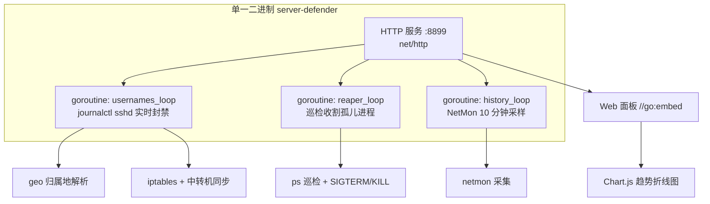

# 🛡️ Server Defender

服务器安全监控与自动防御中心。实时监控 SSH 暴力破解、frps 代理扫描、SYN Flood 攻击，自动封禁恶意 IP，内置主机进程健康自愈（Process Reaper）与网络监控（NetMon），自动收割跑飞失控的死循环孤儿进程。

## 🚀 v2.0.0 Go 重写

**架构变更**：从 Python/Flask 双进程（app.py + usernames.py）重写为 **单一 Go 静态二进制**。合并 `usernames.py` 常驻进程与 `app.py` Web 服务为单进程内的多个 goroutine，彻底移除 venv/Python 依赖。

- ✅ **单文件部署**：`server-defender`（~7.2MB 静态二进制，`CGO_ENABLED=0` 交叉编译，无运行时依赖）
- ✅ **零第三方 Go 依赖**：全部使用 Go 标准库（net/http、html/template、os/exec、encoding/json）
- ✅ **前端内嵌**：HTML/CSS/JS/Chart.js 通过 `//go:embed` 打包进二进制，无外部静态目录
- ✅ **数据兼容**：`data/*.json` 数据结构与 Python 版一致，迁移不丢历史封禁/事件

## 功能

- 🎨 **macOS Sonoma 毛玻璃美学** — 半透明毛玻璃卡片，双栏工作台布局
- 📊 **态势感知仪表盘** — KPI 指标 + 动态趋势
- 🌍 **境外 IP 自动阻断与归属地解析** — 多源高可用 IP 库，境外非法探测永久 iptables 封禁并同步中转机
- 🌊 **网络监控 NetMon** — 实时带宽（各网卡 RX/TX 速率）、连接分析（TCP 状态分布/TOP 对端 IP 归属地）、端口监听透视、网络异常告警（SYN Flood/连接风暴/端口扫描/带宽异常）、24 小时趋势折线图（10 分钟采样）、frps 隧道流量统计
- ⚡ **失控进程自愈 (Process Reaper)** — 巡检收割跑飞的 grep/find 死循环孤儿进程
- 🔥 **实时高 CPU 监控** — 面板一览 TOP 进程，支持手动一键终止
- 🛡️ **frps 自动封禁** — fail2ban 监控 frps 日志自动封禁扫描 SSH 代理的恶意 IP
- 🔐 **用户名风暴防御** — 检测字典爆破用户名风暴自动永久 iptables 封禁

## 架构



**模块划分**（`internal/`）：

| 包 | 职责 |
|---|---|
| `internal/service/` | 业务逻辑：geo 归属地、usernames 封禁循环、reaper 巡检、netmon 采集、store 原子 JSON |
| `internal/handler/` | HTTP 各板块采集 + HTML 片段渲染 + 手动操作（封禁/杀进程） |
| `main.go` | 入口：路由装配 + 三 goroutine 编排 + `//go:embed` 静态资源 |

## 部署

```bash
# 交叉编译（本机生成静态二进制）
CGO_ENABLED=0 GOOS=linux GOARCH=amd64 go build -ldflags "-s -w" -o server-defender .

# 放置到目标机后，supervisor 配置指向二进制
[program:server-defender]
command = /path/to/server-defender
directory = /path/to   # 服务会在此目录下读写 data/
```

数据目录为 `data/`（与二进制同目录），包含封禁状态、geo 缓存、收割事件、网络告警与历史趋势。

## 维护

```bash
supervisorctl restart server-defender   # 重启并热载最新二进制
# 手动单次巡检已废弃（v2.0 由 ReaperLoop goroutine 常驻）
```